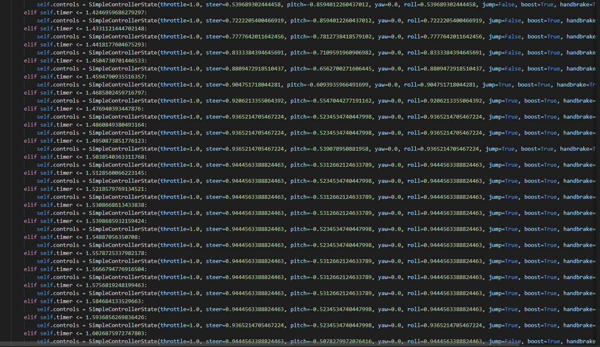

# RLBotSequence

Python agents that record and playback controller-passthroughs.

## Recording
Select the config `recorder.cfg`, and drive around using a pygame supported controller.
Controller button "8" (Share button on a PS4 controller) will toggle recording your controls, this can be seen through the console.
After you toggle off recording, your controls will be dumped to a pickle object.

## Playback

Modify the `initialize_agent` method to correctly select your dumped controls in `playback.py`.
Select the config `playback.cfg`, the bot should replay your previously dumped controls.

## Writing

Run `write.bat`.
This will save all of your dumped controls in a python file, which can be used similarly to a RLUtilities manoeuvre in your own bot.
